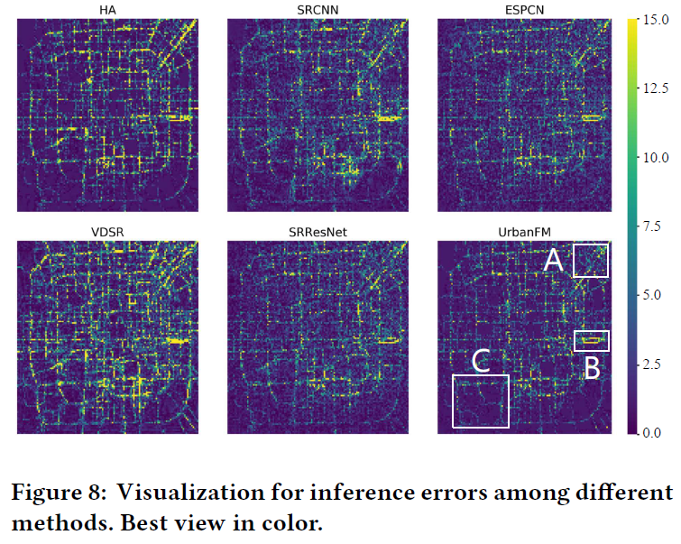

# UrbanFM: Inferring Fine-grained Urban Flows. 
In this study, we aim to infer the real-time and fine-grained crowd flows throughout a city based on coarse-grained observations.

*This is an easy implement of UrbanFM using Pytorch 0.4.1, tested on Ubuntu 16.04 with a TITAN V GPU.*

## Requirements

UrbanFM uses the following dependencies: 

* [Pytorch 0.4.1](https://pytorch.org/get-started/locally/) and its dependencies
* Numpy and Scipy
* [Pandas](http://pandas.pydata.org/)
* CUDA 9.2 or latest version. And **cuDNN** is highly recommended

## Paper
Yuxuan Liang, Kun Ouyang, Lin Jing, Sijie Ruan, Ye Liu, Junbo Zhang, David S. Rosenblum, Yu Zheng, "UrbanFM: Inferring Fine-grained Urban Flows", Arxiv, 2018.

<!-- If you find this code and dataset useful for your research, please cite our paper:

```
``` -->

## Dataset 
The datasets we use for model training is detailed in Section 4.1.1 of our paper. Here, we release P1 in TaxiBJ (7/1/2013-10/31/2013) for public use. Totally, there 1530, 765 and 765 samples in the training, validation and test set respectively. Besides, the corresponding external factors data (e.g., meteorology, time features) are also included. We will release the data of P2 to P4 later. 

User can simply unzip "./P1.zip" to a folder named P1 to obtain the training and test data. For example, the path of training input need to be "./data/P1/train/X.npy".

## Framework


## Model Training
Main input arguments:
- n_epochs: number of training epochs (early stop is forbidden here)
- batch_size: training batch size
- lr: learning rate
- n_residuals: number of residual blocks for feature extraction
- base_channels: number of filters in each residual block
- img_width: width of flow image
- img_height: height of flow image
- channels: input and output channel
- sample_interval: interval between validation
- harved_epoch: halved the learning rate at every x epoch
- upscale_factor: upscaling factor
- ext_dim: dimension of original external factors
- ext_flag: whether to use external factor fusion subnet
- dataset: which dataset to use

The following examples are conducted on dataset TaxiBJ-P1:
* Example 1 (UrbanFM with default settings):
```
python -m UrbanFM.train --ext_flag --dataset "P1"
```

* Example 2 (UrbanFM using arbitrary settings):
```
python -m UrbanFM.train --ext_flag --n_epochs 200 --n_residuals 20 --base_channels 64 --dataset "P1"
```

* Example 3 (UrbanFM-ne, i.e., UrbanFM without external subnet):
```
python -m UrbanFM.train --dataset "P1"
```

* Example 4 (UrbanFM with large amounts of parameters):
```
python -m UrbanFM.train --ext_flag --n_residuals 16 --base_channels 128 --dataset "P1"
```

PS: The trained model will be saved in "./saved_model/P1/#your hyperparameter#/"


## Model Test
To test above trained models, you can use the following command to run our code:
```
python -m UrbanFM.test --ext_flag --n_epochs 200 --n_residuals 20 --base_channels 64 --dataset "P1"
```
## Results
We evaluate our method on TaxiBJ in four different time period and the experimental results are shown as follows:


## Visualization
Here are the two areas in Beijing we visualize. The area1 is the place near Peking University, which is the same as in the Figure 9 in our paper. Area2 is a place near GuangQuMen bridge, mainly a place for residences. 

| AREA1 | AREA2 |
|-- |-- |
|||

### Area1
This is the visualization for the inferred distribution for area1 for a day, from 7:00 to 21:00. From the GIF below we can clearly see that when external factors are not considered (UrbanFM_ne), the inferred distribution remains very stable along with time. That is, there is no difference between flows in the evening and in the morning. However, the inference from UrbanFM is very dynamic and adaptive to time.

| UrbanFM | UrbanFM_ne|
|-- |-- |
|||
|||

### Area2

This is the example for area2, where the top-right conner is a crossroad while other part of this region is residence. When external factors are not considered, it can be seen that the model only focus on the crossroad and cannot adjust to different temporal factor. However, UrbanFM is free from this problem and produce adaptive flow inference. These visualizations suggest UrbanFM indeed considers the external factor for inference. 

| UrbanFM |  UrbanFM_ne|
|-- |-- |
|||
|||

<!-- The following figure depicts the inference errors of different methods. Compared with the baselines, UrbanFM shows its superiority in this visualization.

 -->

## License
UrbanFM is released under the MIT License (refer to the LICENSE file for details).
