# UrbanFM: Inferring Fine-grained Urban Flows. 
In this study, we aim to infer the real-time and fine-grained crowd flows throughout a city based on coarse-grained observations.

*This is an easy implement of UrbanFM using Pytorch 0.4.1, tested on Ubuntu 16.04 with a TITAN V GPU.*

## Paper
Yuxuan Liang, Kun Ouyang, Lin Jing, Sijie Ruan, Ye Liu, Junbo Zhang, David S. Rosenblum and Yu Zheng. "[UrbanFM: Inferring Fine-Grained Urban Flows.](https://arxiv.org/pdf/1902.05377.pdf)", KDD 2019.

If you find our code and dataset useful for your research, please cite our paper (preprint at arxiv):
```
@inproceedings{Liang:2019:UIF:3292500.3330646,
 author = {Liang, Yuxuan and Ouyang, Kun and Jing, Lin and Ruan, Sijie and Liu, Ye and Zhang, Junbo and Rosenblum, David S. and Zheng, Yu},
 title = {UrbanFM: Inferring Fine-Grained Urban Flows},
 booktitle = {Proceedings of the 25th ACM SIGKDD International Conference on Knowledge Discovery and Data Mining},
 series = {KDD '19},
 year = {2019},
 isbn = {978-1-4503-6201-6},
 location = {Anchorage, AK, USA},
 pages = {3132--3142},
 numpages = {11},
 url = {http://doi.acm.org/10.1145/3292500.3330646},
 doi = {10.1145/3292500.3330646},
 acmid = {3330646},
 publisher = {ACM},
 address = {New York, NY, USA},
 keywords = {deep learning, spatio-temporal data, urban computing},
} 
```

## Framework
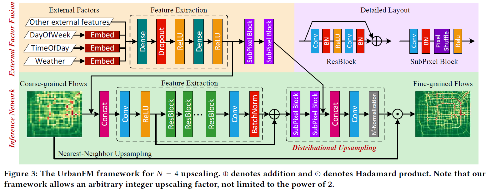

## Results
We evaluate our method on TaxiBJ in four different time periods and the main experimental results are shown as follows:

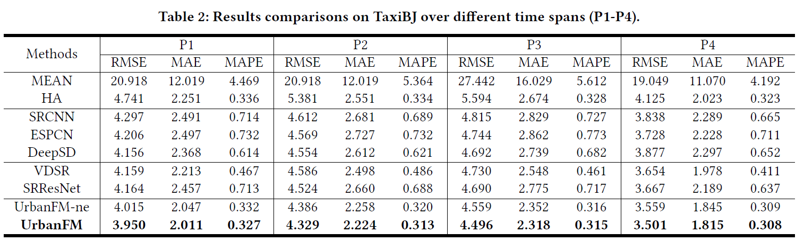

## Visualization
Here are the two areas in Beijing for which we provide dynamic visualizations. The first area is a place near Peking University, which is the same as in the Figure 9 of our paper. Second is a place near GuangQuMen Bridge, which is a main residential area in Beijing. 

| Area near Peking University | Area near GuangQuMen |
|-- |-- |
|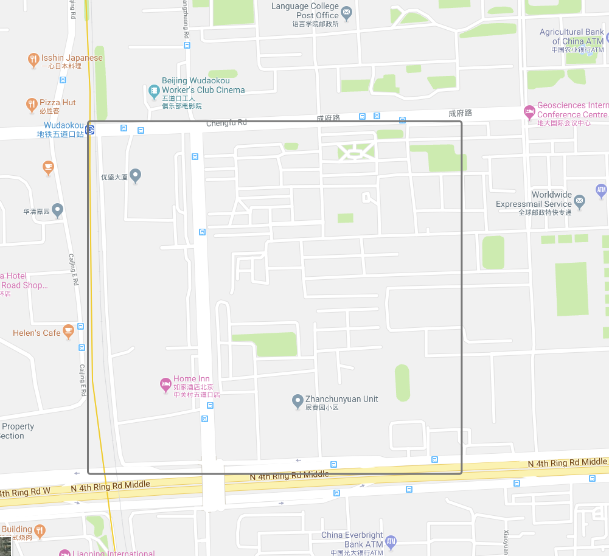|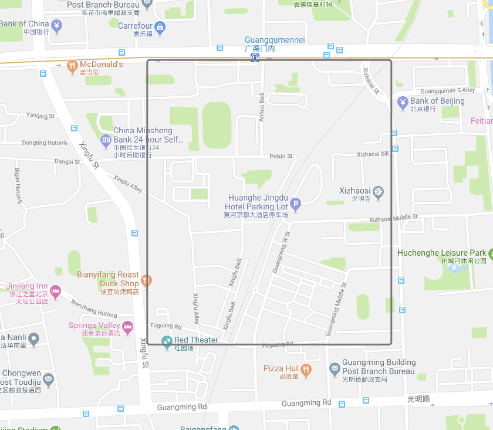|

### Area near Peking University
This is the visualization for the inferred distribution for area1 for a day, from 7:00 to 21:00. From the GIF below we can clearly see that when external factors are not considered (UrbanFM_ne), the inferred distribution remains very stable along with time changes. That is, there is no difference between flows in the evening and in the morning, which is intuitively inappropriate. However, the inference from UrbanFM is very dynamic and can adapt to time, which faithfully reflects that how people left from home to the research centers in the daytime and return home in the evening on weekdays, as well as different moving patterns on weekends.

| UrbanFM | UrbanFM_ne|
|-- |-- |
|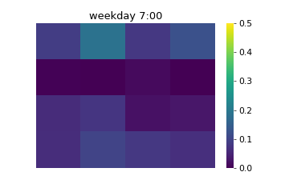|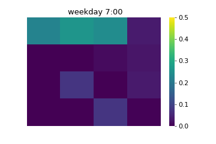|
|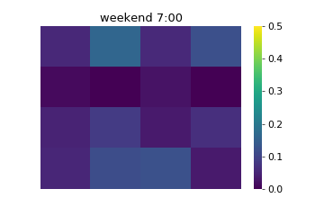|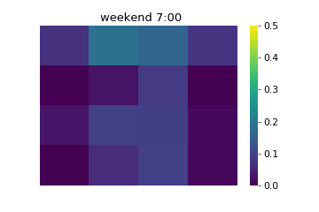|

### Area near GuangQuMen
In this area, the top-right corner is the main crossroad where the other parts of this region are residences. When external factors are not considered, it can be seen that the model (UrbanFM_ne) only focuses on the crossroad and cannot adjust to different temporal factors. However, UrbanFM is free from this problem and produce adaptive flow inference. These visualizations suggest UrbanFM indeed considers the external factor for inference. 

| UrbanFM |  UrbanFM_ne|
|-- |-- |
|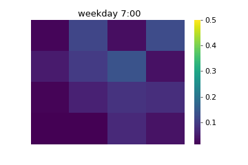|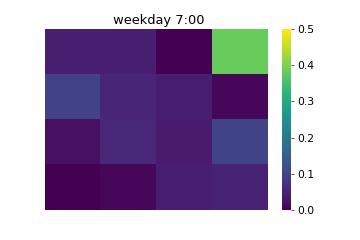|
|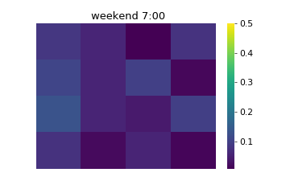|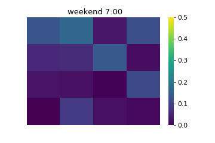|

## Requirements

UrbanFM uses the following dependencies: 

* [Pytorch 0.4.1](https://pytorch.org/get-started/locally/) and its dependencies
* Numpy and Scipy
* [Pandas](http://pandas.pydata.org/)
* CUDA 9.2 or latest version. And **cuDNN** is highly recommended


<!-- If you find this code and dataset useful for your research, please cite our paper:

```
``` -->

## Dataset 
The datasets we use for model training is detailed in Section 4.1.1 of our paper. Here, we release P1 in TaxiBJ (7/1/2013-10/31/2013) for public use. Totally, there 1530, 765 and 765 samples in the training, validation and test set respectively. Besides, the corresponding external factors data (e.g., meteorology, time features) are also included. We will release the data of P2 to P4 later. 

User can simply unzip "./P1.zip" to a folder named P1 to obtain the training and test data. For example, the path of training input need to be "./data/P1/train/X.npy".

## Model Training
Main input arguments:
- n_epochs: number of training epochs (early stop is forbidden here)
- batch_size: training batch size
- lr: learning rate
- n_residuals: number of residual blocks for feature extraction
- base_channels: number of filters in each residual block
- img_width: width of flow image
- img_height: height of flow image
- channels: input and output channel
- sample_interval: interval between validation
- harved_epoch: halved the learning rate at every x epoch
- upscale_factor: upscaling factor
- ext_dim: dimension of original external factors
- ext_flag: whether to use external factor fusion subnet
- dataset: which dataset to use

The following examples are conducted on dataset TaxiBJ-P1:
* Example 1 (UrbanFM with default settings):
```
python -m UrbanFM.train --ext_flag --dataset "P1"
```

* Example 2 (UrbanFM using arbitrary settings):
```
python -m UrbanFM.train --ext_flag --n_epochs 200 --n_residuals 20 --base_channels 64 --dataset "P1"
```

* Example 3 (UrbanFM-ne, i.e., UrbanFM without external subnet):
```
python -m UrbanFM.train --dataset "P1"
```

* Example 4 (UrbanFM with large amounts of parameters):
```
python -m UrbanFM.train --ext_flag --n_residuals 16 --base_channels 128 --dataset "P1"
```

PS: The trained model will be saved in "./saved_model/P1/#your hyperparameter#/"


## Model Test
To test above trained models, you can use the following command to run our code:
```
python -m UrbanFM.test --ext_flag --n_epochs 200 --n_residuals 20 --base_channels 64 --dataset "P1"
```

## License
UrbanFM is released under the MIT License (refer to the LICENSE file for details).
